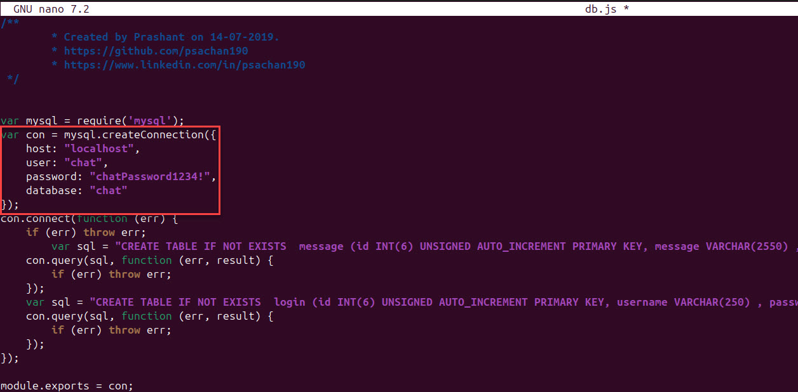
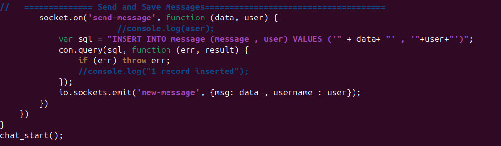
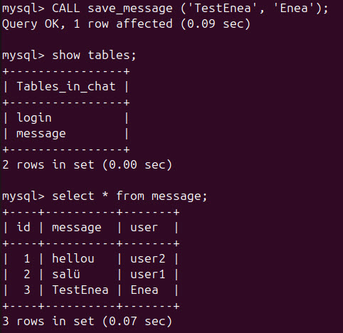
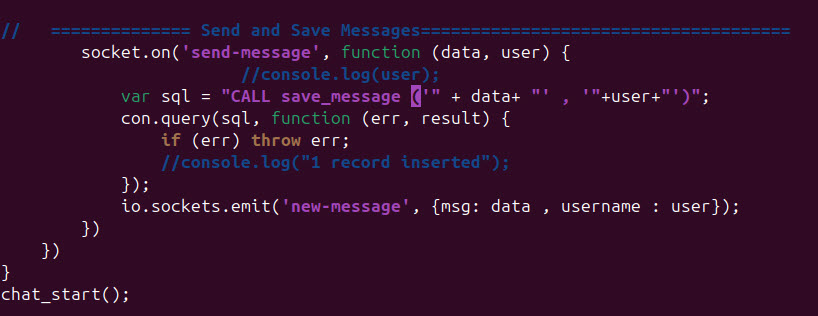
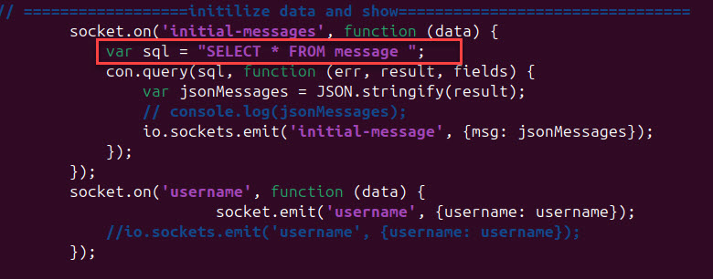
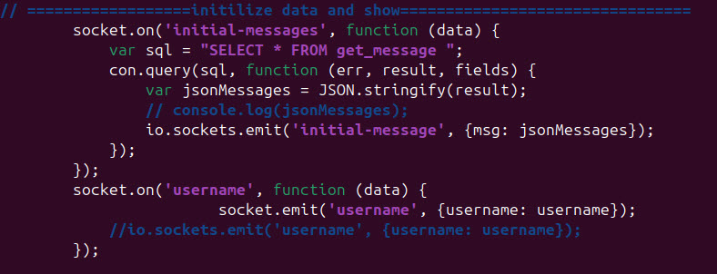

# Chat Applikation

## Installation
1. Github Repo klonen
   ```
   git clone --branch master https://github.com/prashanttsachan/realtime-chat-application-using-nodejs-expressjs-and-web-socket.git
   ```
2. In Verzeichnis gehen
   ```
   cd realtime-chat-application-using-nodejs-expressjs-and-web-socket
   ```
3. Installieren
   ```
   npm install
   ```
4. Datenbank erstellen
   ```sql
   CREATE DATABASE chat;
   ```
5. Benutzer erstellen, welcher alle Rechte auf der `chat` DB hat
   ```sql
   CREATE USER 'chat'@'localhost' IDENTIFIED BY 'chatPassword1234!';
   GRANT SELECT,INSERT,UPDATE,DELETE,CREATE,DROP ON chat.* TO 'chat'@'localhost';
   ```
6. User verändern, dass er sich mit dem alten Mysql-Plugin anmelden kann
   ```sql
   ALTER USER 'chat'@'localhost' IDENTIFIED WITH mysql_native_password BY 'chatPassword1234!';
   ```
7. Datenbank Konfig File öffnen
   ```
   sudo nano realtime-chat-application-using-nodejs-expressjs-and-web-socket/database/db.js
   ```
8. Datenbankinfos anpassen
   
9. Applikation starten
   ```
   cd realtime-chat-application-using-nodejs-expressjs-and-web-socket
   node server.js
   ```
10. Logins in der DB erstellen
    ```sql
    INSERT INTO login VALUES ('1','user1','user1');
    INSERT INTO login VALUES ('2','user2','user2');
    ```


## Testing
1. Zweiten Browser installieren
   ```
   sudo apt install chromium
   ```
2. Seite öffnen
   ```
   http://localhost:3000/
   ```
3. Beim einem Browser mit User 1 und beim anderen mit User 2 anmelden \
   Jetzt kann man Nachrichten an den andere schicken


## Stored Procedure
Folgendes SQL sollte via Stored Procedure ausgeführt werden können.



```sql
DELIMITER //
CREATE PROCEDURE save_message 
(
   IN data varchar(500),
   IN user varchar(250) 
) 
BEGIN 
   INSERT INTO message
   (
      message,
      user
   ) VALUES 
   (
      data,
      user
   ); 
END//
DELIMITER ;
```

**Chat-User auf die Stored Procedure berechtigen**
```sql
GRANT EXECUTE ON PROCEDURE save_message TO 'chat'@'localhost';¨
FLUSH PRIVILEGES;
```

Aufruf: \



Angepasstes Server.js: \



## Views
Folgendes SQL sollte via View ausgeführt werden können.


```sql
CREATE VIEW get_message AS
   SELECT * 
   FROM message;
```

Angepasstes Server.js: \
