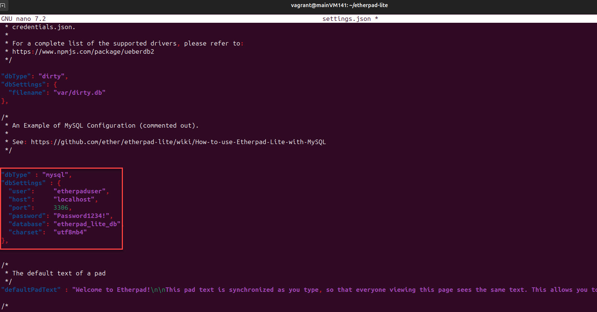

# Etherpad


## Installation
1. Laufzeitumgebung installieren
   ```
   # Infrastruktur vorbereiten
   curl -sL https://deb.nodesource.com/setup_23.x | sudo -E bash -
   # Pakete installieren
   apt install -f
   ```
2. Github clonen
   ```
   git clone --branch master https://github.com/ether/etherpad-lite.git
   cd etherpad-lite
   ```


## Konfiguration
1. Mit Mysql verbinden
   ```
   mysql -u root -p
   ```
2. Folgende Befehle ausführen
   ```
   create database `etherpad_lite_db`;
   -- Create a new database user. Replace <etherpaduser> and <password> with your own values. 
   CREATE USER 'etherpaduser'@'localhost' identified by 'Password1234!';
   ALTER USER 'etherpaduser'@'localhost' IDENTIFIED WITH mysql_native_password BY 'Password1234!';
   -- Grant permissions to that new database account. Replace <etherpaduser> with your own value from above step. 
   GRANT CREATE,ALTER,SELECT,INSERT,UPDATE,DELETE on `etherpad_lite_db`.* to 'etherpaduser'@'localhost';
   ```
3. Settings für Ehterpad kopieren
   ```
   cp settings.json.template settings.json
   ```
4. Settings bearbeiten
   ```
   sudo nano settings.json
   ```
   Abschnitt einkommentieren und Passwort anpassen
   


### Plugins
1. Überprüfen ob node installiert ist
   ```
   node -v
   ```
2. Falls nicht, installieren
   ```
   sudo apt install nodejs
   ```


## Starten
1. Ins Etherpad verzeichnis gehen
   ```
   cd etherpad-lite
   ```
2. Etherpad starten und frage bestätigen
   ```
   sudo bin/run.sh
   ```
3. Etherpad im Browser öffnen
   ```
   http://localhost:9001
   ```