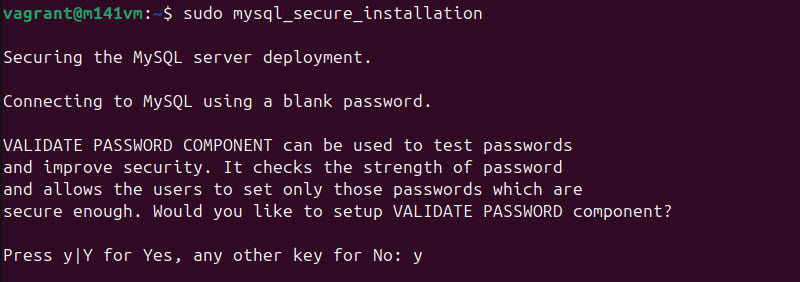
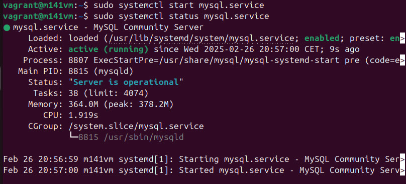

# MySQL installieren
Ich habe die Version 8.0.41 heruntergeladen. \
[Weitere Infos](../Theorie/VoraussetzungenInstallationMySQL.md?id=quelle-von-der-software)

## Installation
### MySQL installieren
1. System aktualisieren
   ```
   sudo apt update
   sudo apt upgrade
   ```
2. MySQL Server installieren
   ```
   sudo apt install mysql-server
   ```
3. MySQL Service starten und überprüfen
   ```
   sudo systemctl start mysql.service
   sudo systemctl status mysql.service
   ```
   


### Secure Installation Script
Damit die MySQL Installation den entsprechenden Sicherheitstandard entspricht, empfiehlt es sich sehr, die secure installation durchzuführen. Ich habe nun bewusst auf einige Features verzichtet, weil ich diese Installation für Tests in diesem Modul benutzen werde.

1. Secure Installation starten
   ```
   sudo mysql_secure_installation
   ```
2. Auswählen ob man die validate Passwort funktion möchte, hiermit wird sichergestellt, dass jeder User ein sicheres Passwort benutzt. \
   In meinem Fall habe ich dies mit "yes" bestätigt. \
   
3. Passwort Policy auswählen. Dies legt fest, wie sicher ein neues Passwort sein muss, hier habe ich LOW ausgewählt, weil dies kein produktives System ist. \
   
4. Anonyme User entfernen. Dies legt fest, ob man sich immer anmelden muss, um auf die Datenbank zu kommen. Hier habe ich "NO" gewählt, weil dies kein produktives System ist. \
   
5. Remote Login für Root deaktivieren. Hier wird festegelegt, ob man sich per Remot Login mit dem Root User anmelden kann. Dies habe ich beibehalten, da dies für meine Testzwecke nützlich sein könnte und dies kein produktives System ist. \
   
6. Test Datenbank entfernen. Hier wird gefragt, ob die Standard Test Datenbank, welche von MySQL automatisch angelegt wird gelöscht werden soll. Dies habe ich bestätigt, weil ich keine Verwendung dafür habe. \
   Als Abschluss habe ich noch einmal alle Tabellen neu geladen, damit die Optionen greifen. \
   

### Start on Boot aktivieren
Damit MySQL mit dem Server direkt startet, müssen folgende Schritte durchgeführt werden:
```
sudo systemctl enable mysql.service
```

### Connect to MySQL


## Testing

**Wie startet der Dienst?**
```
sudo systemctl start mysql.service
```

**Wie überprüfe ich den Status vom Dienst?**
```
sudo systemctl status mysql.service
```


**Wie stelle ich eine Verbindung über die Konsole mit dem DBMS her?**
```
sudo mysql
```

**Wie zeige ich alle bereits vorhanden Datenbanken an?**
```sql
show databases;
```


**Wie sehe ich alle bereits erstellten Benutzer?**
```sql
SELECT user, host FROM mysql.user;
```

**Wie sehe ich meine DBMS version?**
```sql
Select version();
```


**Wie teste ich eine neue Datenbank?**
```sql
CREATE DATABASE testdb;
USE testdb;
CREATE TABLE testtable (id INT PRIMARY KEY, name VARCHAR(50));
SHOW TABLES;
DROP TABLE testtable;
DROP DATABASE testdb;
```
