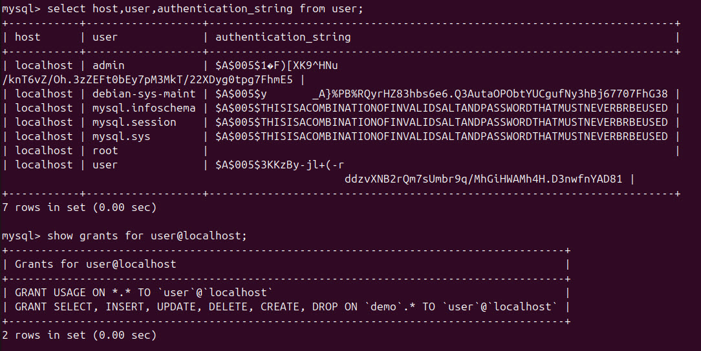
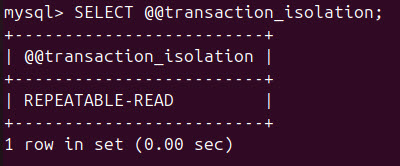
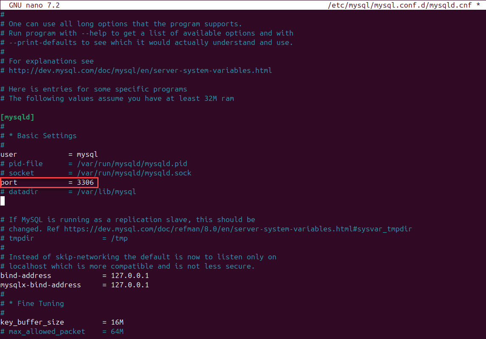
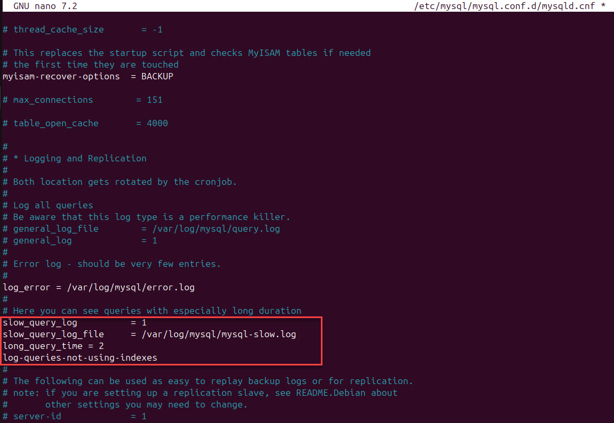
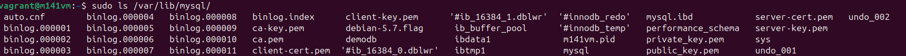

# MySQL Konfiguration

## Storage Engine
[Theorie](../Theorie/StorageEngines.md)

### Storage Engine bei einer neuen Tabelle wählen
Wenn man eine spezielle Storage Engine für eine Tabelle wählen möchte, kann man dies so machen
```sql
CREATE TABLE csvTest (csvID INT Primary Key, name) ENGINE = CSV;
CREATE TABLE csvMemory (i INT) ENGINE = MEMORY;
```

## Benutzer konfigurieren
Alle user können so abgerufen werden.
```sql
USE mysql;
select * from user;

-- Schönere Ausgabe
select host,user,authentication_string from user;

-- Beschreibung der Attribute
DESCRIBE user;
```

!> Damit Berechtigungen übernommen werden, ist ein Befehl sehr wichtig! \
    ```
FLUSH PRIVILEGES;
    ```


### Root
1. Passwort für den Root user setzen
   ```sql
   ALTER USER 'root'@'localhost' IDENTIFIED BY 'root1234';
   FLUSH PRIVILEGES;
   ```
2. Überprüfen, von wo aus sich Root überall anmelden darf --> sollte nur vom localhost möglich sein!
   ```sql
   SELECT User, Host, plugin FROM mysql.user WHERE User = 'root';
   ```
   
   Falls nicht, folgenden Command ausführen:
   ```sql
   UPDATE mysql.user SET Host = 'localhost' WHERE User = 'root';
   ```

### Benutzer konfigurieren
1. User erstellen
   ```sql
   CREATE USER 'user'@'localhost' IDENTIFIED BY 'userPassword1234!';
   ```
2. User auf die gewünschten Tabellen Zugriff geben \
   Hier gebe ich dem User nur SELECT & INSERT, weil er ein Anewdungsbenutzer ist, auf die Datenbank `demo`
   ```sql
   GRANT SELECT,INSERT ON demo.* TO 'user'@'localhost';
   ```
   Hier habe ich noch ein Admin Benutzer erstellt
   ```sql
   CREATE USER 'admin'@'localhost' IDENTIFIED BY 'adminPassword1234!';
   GRANT SELECT,INSERT,UPDATE,DELETE,CREATE,DROP ON demo.* TO 'admin'@'localhost';
   ```
   


## Sever Konfiguration

### Transaktions-Isolation
Um die Transaktions-Isolations-Stufe abzurufen, kann man folgenden Befehl verwenden.
```sql
SELECT @@transaction_isolation;
```


| Anomalie              | Erklärung                                                                                                   |
|-----------------------|-----------------------------------------------------------------------------------------------------------|
| **Dirty Reads**       | Eine Transaktion kann keine Änderungen sehen, die von einer anderen Transaktion noch nicht bestätigt wurden. |
| **Non-Repeatable Reads** | Wenn eine Transaktion eine Zeile zweimal liest, bleibt der Wert gleich, selbst wenn eine andere Transaktion ihn zwischenzeitlich ändert. |
| **Phantom Reads**     | Neue Datensätze, die in einer anderen Transaktion eingefügt werden, könnten sichtbar werden, wenn eine erneute Abfrage durchgeführt wird. |


### System Variablen
Mit folgendem Befehl, können alle System Variablen ausgegeben werden.
```sql
show variables\G;
```


### Netzwerkkonfiguration
1. Konfigurationsdatei öffnen
   ```
   sudo nano /etc/mysql/mysql.conf.d/mysqld.cnf;
   ```
#### TCP Port öffnen
1. Port Zeile einkommentieren --> Der Standardport ist 3306
   ```
   port          = 3306
   ``` 
   
2. SQL server neu starten
   ```
   sudo systemctl restart mysql
   ```


## Server Betrieb

### Protokollierung langsamer Abfragen aktivieren
1. Konfigurationsdatei öffnen
   ```
   sudo nano /etc/mysql/mysql.conf.d/mysqld.cnf;
   ```
2. Folgende 4 Zeilen auskommentieren
   ```
   [mysqld]
   slow_query_log = 1
   slow_query_log_file = /var/log/mysql/slow.log
   long_query_time = 2
   log_queries_not_using_indexes = 1
   ```
   
3. SQL server neu starten
   ```
   sudo systemctl restart mysql
   ```

### Inhalt des Data-Directories auflisten
Im Data Directory, werden alle Datenbankdaten gespeichert!

1. Nachschauen, wo sich das Data Directory befindet
   ```sql
   SHOW VARIABLES LIKE 'datadir';
   ```
2. Pfad öffnen
   ```
   sudo ls /var/lib/mysql/
   ```
   

### Default Datenbanken
In MySQL gibt es mehrere Default Datenbanken, welche bei der Installation von MySQL automatisch installiert werden.

#### MySQL
```sql
use mysql;
```
Hier gibt es folgende drei wichtige Tabellen:
- user
  ```sql
  Select * from user\G;
  ```
  Hier werden alle Benutzerkontoinformationen gespeichert.
- db
  ```sql
  Select * from db\G;
  ```
  Hier wird für jede Datenbank beschrieben, welcher User, welche Rechte auf jeder Datenbank hat.
- tables_priv
  ```sql
  Select * from tables_priv\G;
  ```
  Hier wird für jede Tabelle von der Datenbank beschrieben, welcher User, welche Rechte auf jede Tabelle hat.

#### SYS
In dieser Datenbank, findet man viele Infos für die Überwachung der Performance vom MySQL Server.
```sql
use sys;
```
- host_summary
  ```sql
  Select * from host_summary\G;
  ```
  Hier sieht man alle Verbindungen, welche aktuell mit dem MySQL Server bestehen und wie viele Ressourcen diese verbrauchen.


#### performance_schema
Detaillierte Information zur aktuellen Leistung von MySQL
```sql
use performance_schema;
```
- events_statements_summary_by_digest
  ```sql
  Select * from events_statements_summary_by_digest\G;
  ```
  Zeigt die häufigsten Abfragen an, welche gemacht wurden
- threads
  ```sql
  Select * from threads\G;
  ```
  Zeigt alle aktuellen Threads an.
