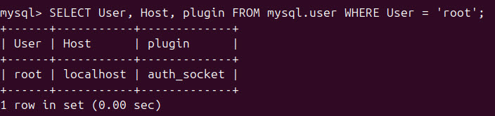

# MySQL Konfiguration

## Storage Engine
[Theorie](../Theorie/StorageEngines.md)

### Storage Engine bei einer neuen Tabelle wählen
Wenn man eine spezielle Storage Engine für eine Tabelle wählen möchte, kann man dies so machen
```sql
CREATE TABLE csvTest (csvID INT Primary Key, name) ENGINE = CSV;
CREATE TABLE csvMemory (i INT) ENGINE = MEMORY;
```

!> Damit Berechtigungen übernommen werden, ist ein Befehl sehr wichtig! \
    ```
FLUSH PRIVILEGES;
    ```

## Benutzer konfigurieren
Alle user können so abgerufen werden.
```sql
USE mysql;
select * from user;

-- Schönere Ausgabe
select host,user,authentication_string from user;

-- Beschreibung der Attribute
DESCRIBE user;
```

### Root
1. Passwort für den Root user setzen
   ```sql
   ALTER USER 'root'@'localhost' IDENTIFIED BY 'root1234';
   FLUSH PRIVILEGES;
   ```
2. Überprüfen, von wo aus sich Root überall anmelden darf --> sollte nur vom localhost möglich sein!
   ```sql
   SELECT User, Host, plugin FROM mysql.user WHERE User = 'root';
   ```
   
   Falls nicht, folgenden Command ausführen:
   ```sql
   UPDATE mysql.user SET Host = 'localhost' WHERE User = 'root';
   ```

### Benutzer konfigurieren
1. User erstellen
   ```sql
   CREATE USER 'user'@'localhost' IDENTIFIED BY 'userPassword1234!';
   ```
2. User auf die gewünschten Tabellen Zugriff geben \
   Hier gebe ich dem User nun Vollzugriff auf die Datenbank `demo`
   ```sql
   GRANT SELECT,INSERT,UPDATE,DELETE,CREATE,DROP ON demo.* TO 'user'@'localhost';

   ```
