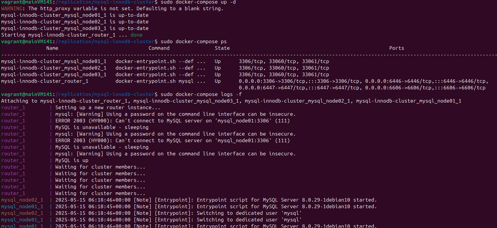
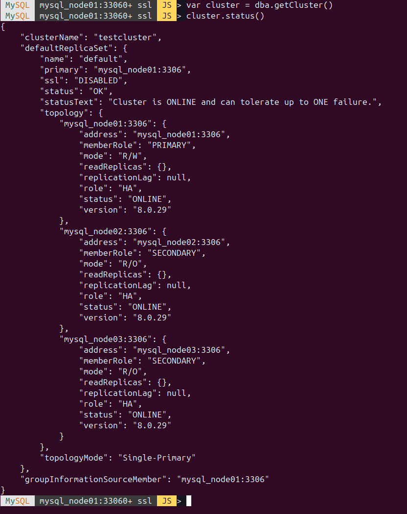

# MySQL - Replikation

## Router
1. Verzeichnis erstellen
   ```
   sudo mkdir /replication
   ```
2. Github repo klonen
   ```
   sudo git clone https://github.com/garutilorenzo/mysql-innodb-cluster.git
   ```
3. Docker pullen
   ```
   sudo docker-compose pull
   ```
4. MySQL beenden & Docker starten
   ```
   sudo systemctl stop mysql.service
   sudo docker-compose up -d
   ```
5. Docker überwachen
   ```
   sudo docker-compose ps
   sudo docker-compose logs -f
   ```
   
6. MySQL Shell installieren
   ```
   sudo apt install mysql-shell
   ```
7. Auf Master Node einloggen
   ```
   cd /replication/mysql-innodb-cluster
   sudo docker-compose exec mysql_node01 bash
   ```
8. Einloggen
   ```
   mysqlsh --js root@mysql_node01
   ```
   Passwort: root
9. Status abrufen \
    
10. Docker beenden
    ```
    docker-compose down
    ```


## ProxySQL und Spring Boot 
1. Verzeichnis erstellen
   ```
   sudo mkdir /ProxySQLSpringBoot
   ```
2. Github repo klonen
   ```
   sudo git clone https://github.com/ivangfr/springboot-proxysql-mysql.git
   ```
3. MySQL stoppen
   ```
   sudo systemctl stop mysql.service
   ```
4. Environment starten
   ```
   cd /ProxySQLSpringBoot/springboot-proxysql-mysql
   sudo ./init-environment.sh
   ```
5. In einem neuen Terminal MySQl Replication überprüfen
   ```
   cd /ProxySQLSpringBoot/springboot-proxysql-mysql
   sudo ./check-replication-status.sh
   ```