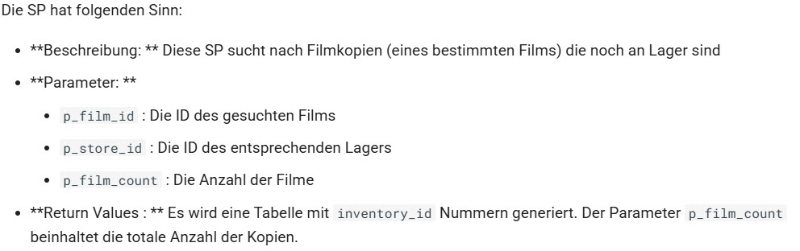
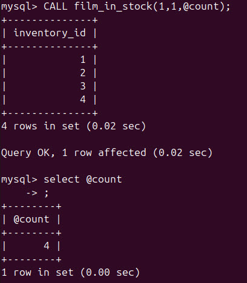
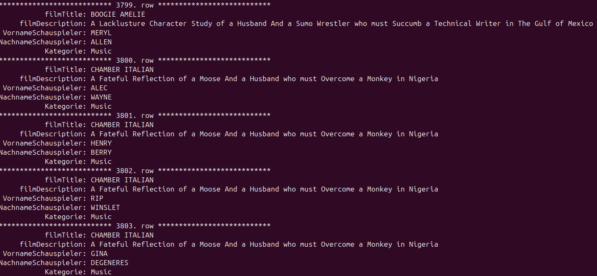

# Sakila

## Installation
1. Archiv File herunterladen \
   [Download](https://downloads.mysql.com/docs/sakila-db.zip)
2. Entpacken via GUI
3. Terminal öffnen **Nicht im MySQL**
4. Schema importieren
   ```
   /usr/bin/mysql -u root -pRoot1234! < /home/vagrant/Downloads/sakila-db/sakila-schema.sql
   ```
5. Daten importieren
   ```
   /usr/bin/mysql -u root -pRoot1234! < /home/vagrant/Downloads/sakila-db/sakila-data.sql
   ```


## Testing
1. MySQl öffnen
2. Datenbank benutzen
   ```sql
   USE sakila;
   ```
3. Tables auf der DB anzeigen
   ```sql
   SHOW FULL TABLES;
   ```
4. Alle Einträge auf der Tabelle `film` zählen
   ```sql
   SELECT COUNT(*) FROM film;
   ```
5. Alle Einträge auf der Tabelle `film_text` zählen
   ```sql
   SELECT COUNT(*) FROM film_text;
   ```


## Anzeigen
1. Zeigen Sie alle Views der Datenbank sakila an
   ```sql
   show full tables where table_type = 'VIEW';
   ```
2. Zeigen Sie alle Stored Procedures der Datenbank sakila an
   ```sql
   SHOW PROCEDURE STATUS WHERE db = 'sakila';
   ```
3. Zeigen Sie alle Triggers der Datenbank sakila an
   ```sql
   show triggers in sakila;
   ```


## Stored Procedure
Anforderungen: \


Create Befehl:
```sql
DELIMITER //
CREATE PROCEDURE film_in_stock (
    IN p_film_id int,
    IN p_store_id int,
    OUT p_film_count int
) 
BEGIN 
    select inventory_id from inventory where film_id=p_film_id AND store_id=p_store_id; 
    SELECT Count(*) INTO p_film_count from inventory where film_id=p_film_id AND store_id=p_store_id; 
END//
DELIMITER ;
```

Danach sieht es so aus: \



## View
Anforderung: \
Es werden alle Schauspieler aufgelistet, inklusive der Filme in welchen sie gearbeitet haben (angereichert mit der Information über die Filmkategorie)

Create Befehl:
```sql
CREATE VIEW actor_info2 as 
select 
    film.title as filmTitle,
    film.description as filmDescription,
    first_name as VornameSchauspieler,
    last_name as NachnameSchauspieler,
    category.name as Kategorie
from film_actor 
JOIN actor 
    ON film_actor.actor_id=actor.actor_id 
JOIN film_category 
    ON film_actor.film_id=film_category.film_id 
JOIN category
    ON film_category.category_id=category.category_id 
JOIN film 
    ON film_actor.film_id=film.film_id;
```

Danach sieht es so aus:
```sql
select * from actor_info2 \G;
```
