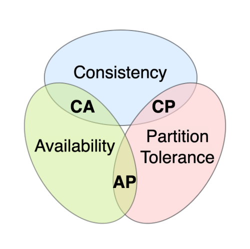

# Begriffe in SQL


## SQL
SQL steht für Structured Query Language. SQL ist eine Datenbanksprache, mit welcher Daten abgefragt, verwaltet und manipuliert werden können.
Mit SQL kann man Datenbanken erstellen sowie Daten einfügen, abfragen, aktualisieren und löschen.

## SQL DDL
Mit DDL (Data Definition Language) werden Datenstrukturen erstellt, verändert oder gelöscht. \
Hier ein paar Beispiele: 
- Tabelle erstellen
  ```sql
  CREATE TABLE Kunden (
    KundenID INT PRIMARY KEY,
    Name VARCHAR(100) NOT NULL,
    Email VARCHAR(255),
    Geburtsdatum DATE,
    Telefonnummer VARCHAR(20)
  );
  ```
- Tabelle löschen
  ```sql
  DROP TABLE Kunden;
  ```
- Tabelle verändern
  ```sql
  -- Spalte hinzufügen
  ALTER TABLE Kunden ADD Adresse VARCHAR(255);
  -- Spaltentyp ändern
  ALTER TABLE Kunden ALTER COLUMN Telefonnummer VARCHAR(30);
  -- Spalte löschen
  ALTER TABLE Kunden DROP COLUMN Geburtsdatum;
  ```

## SQL DML
Mit DML (Data Manipulation Language) werden Daten ausgewählt, gelöscht oder erstellt. \
Hier ein paar Beispiele: 
- Daten auswählen
  ```sql
  -- Alle Spalten
  SELECT * FROM Kunden;
  -- Bestimmte Spalten
  SELECT Name, Email FROM Kunden;
  -- Spalten mit einer Bedingung filtern
  SELECT * FROM Kunden WHERE KundenID = 1;
  ```
- Daten löschen
  ```sql
  DELETE FROM Kunden WHERE KundenID = 5;
  ```
- Daten erstellen
  ```sql
  INSERT INTO Kunden (KundenID, Name, Email, Geburtsdatum, Telefonnummer)  
  VALUES (1, 'Max Mustermann', 'max@example.com', '1990-05-15', '+49123456789');
  ```


## ACID


### Atomicity (Atomarität)
Eine Transaktion wird immer ganz oder gar nicht ausgeführt.
Es gibt nur zwei Möglichkeiten:
- Alle Änderungen erfolgreich umgesetzt 
- Gar keine Änderung wurde umgesetzt


### Consistency (Konsistenz)
Nach einer Transaktion verhält sich die Datenbank so, dass alle festgelegten Regeln und Vorschriften eingehalten werden. 
Dazu zählt:
- Verhindern von doppelten Werten
- Gewährleisten korrekter Beziehungen zwischen Tabellen (z. B. muss eine Bestellung einen gültigen Kunden haben)
- Einhaltung festgelegter Formate oder Zahlenbereichen(z. B. darf kein Geburtsdatum in der Zukunft liegen)

So wird sichergestellt, dass die Daten immer richtig und logisch sind.

### Isolation (Isolation):
Jede Transaktion läuft unabhängig von anderen, wodurch parallele Transaktionen sich nicht gegenseitig beeinflussen. Selbst wenn sie gleichzeitig ausgeführt werden, beeinflussen sie sich nicht.

### Durability (Dauerhaftigkeit): 
Sobald eine Transaktion abgeschlossen ist, bleiben die Änderungen auch nach einem Absturz des Systems erhalten.

## BASE
BASE ist ein Prinzip, das häufig bei NoSQL-Datenbanken verwendet wird und als Gegenmodell zum ACID-Prinzip betrachtet wird.  Während ACID eine starke Konsistenz garantiert, setzt BASE auf Flexibilität und Verfügbarkeit. BASE steht für: 
- **Basically Available** \
Die Datenbank ist immer verfügbar, selbst wenn einige Daten vorübergehend nicht abrufbar oder unvollständig sind. \
Beispiel: In einem Online-Shop kannst du eine Bestellung tätigen, auch wenn der aktuelle Lagerbestand nicht überprüft wurde.
- **Soft State** \
Daten können sich im Lauf der Zeit ändern, auch ohne direkte Eingaben. \
Beispiel: Eine zwischengespeicherte Produktseite zeigt möglicherweise einen alten Preis, der sich später automatisch aktualisiert.
- **Eventual Consistency** \
Die Daten sind nicht sofort konsistent, sondern werden im Laufe der Zeit synchronisiert. \
Beispiel: Es kann einen Moment dauern, nachdem du im Onlineshop bestellt hast, bis der Lagerbestand für alle Nutzer korrekt angezeigt wird.


Auch wenn kurzfristig veraltete oder nicht ganz aktuelle Daten angezeigt werden, ermöglicht dieses Prinzip eine hohe Skalierbarkeit und Performance.


## CAP-Theorem


Der CAP-Theorem gemäss muss ein Datenbanksystem, das über mehrere Server oder Standorte verteilt ist einen Kompromiss zwischen drei Eigenschaften eingehen: Konsistenz (Consistency, C), Verfügbarkeit (Availability, A) und Partitionstoleranz (Partition Tolerance, P). Es ist nicht möglich, alle drei Eigenschaften vollständig zu erfüllen.
- **Consistency (Konsistenz)** \
Alle Nutzer sehen immer die gleichen Daten. \
Beispiel: Bei einer Bestellung in einem Onlineshop wird der Lagerbestand sofort für alle aktualisiert.
- **Availability (Verfügbarkeit)** \
Das System antwortet immer auf Anfragen, selbst wenn einige Teile der Datenbank momentan nicht erreichbar sind. \
Beispiel: Ein Onlineshop kann trotzdem Bestellungen annehmen, selbst wenn einige Teile der Datenbank langsam reagieren oder teilweise ausgefallen sind.
- **Partition Tolerance (Partitionstoleranz)** \
Auch bei Unterbrechungen der Verbindungen zwischen Servern bleibt das System funktionsfähig. \
Beispiel: Auch wenn ein Server in einem Rechenzentrum ausfällt, bleibt der Online-Shop verfügbar.

Moderne Datenbanken sind oft über mehrere Standorte verteilt (Partition Tolerance ist unverzichtbar, da bei der Verteilung von Daten auf verschiedene Server oder geografische Standorte immer die Möglichkeit besteht, dass Verbindungen zwischen den Servern unterbrochen werden – sei es durch Netzwerkfehler oder Ausfälle), deshalb muss ein System entweder bei Consistency oder Availability Abstriche machen.


## Transaktion
Eine Datenbanktransaktion besteht aus mehreren Operationen, die auf einer Datenbank durchgeführt werden und als eine einzige logische Arbeitseinheit angesehen werden – sie werden entweder vollständig ausgeführt oder gar nicht. Mit anderen Worten: Es gibt nie einen Fall, dass nur die Hälfte der Transaktion ausgeführt und die Ergebnisse gespeichert werden. \
**Beispiel:** \
Das Überweisen von Geld zwischen Konto A und Konto B. Angenommen, du willst 5 CHF von Konto A auf Konto B überweisen. Diese Aktion kann in die folgenden einfachen Operationen unterteilt werden:
1. Lege einen Datensatz an, um 5 CHF von Konto A auf Konto B zu überweisen. Dies wird gewöhnlich als Startpunkt einer Datenbanktransaktion bezeichnet.
2. Lese den Kontostand von Konto A
3. Ziehe 5 CHF vom Kontostand von Konto A ab
4. Lese den Kontostand von Konto B
5. Addiere 5 CHF zu Konto B

Wenn deine Datenbank diese Transaktion als eine gesamte Einheit ausführt und das System beispielsweise wegen eines Stromausfalls abstürzt, wird die Transaktion rückgängig gemacht, wodurch die Datenbank in ihren ursprünglichen Zustand zurückversetzt wird.