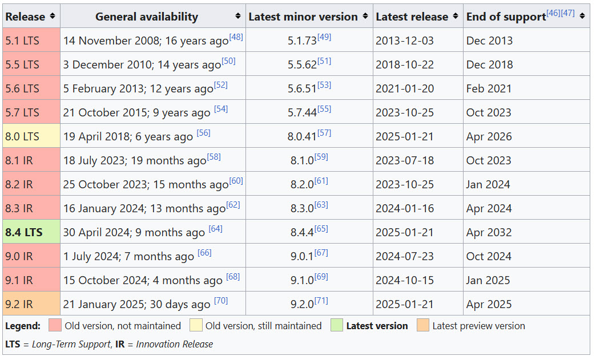

# MySQL
MySQL ist ein RDBMS (relationales Datenbankmanagementsystem), das zur Speicherung, Verwaltung und Abfrage Daten dient. Es basiert auf SQL (Structured Query Language) und wird häufig verwendet in Webanwendungen, Unternehmenssoftware und Cloud-Diensten. MySQL zeichnet sich durch seine hohe Leistung, Skalierbarkeit und Verlässlichkeit aus.

## Hersteller
Ursprünglich wurde MySQL vom schwedischen Unternehmen MySQL AB entwickelt. Im Januar 2010 wurde MySQL von der Oracle Corporation aufgekauft. 

## Lizenzen & Support
MySQL wird mit einem dualen Lizenzmodell angeboten: 
- Open-Source-Lizenz: \
  Die Community Edition ist kostenlos nutzbar, dafür gibt es keinen offizielen Support von Oracle.
- Kommerzielle Lizenz: \
  Für Unternehmen bietet Oracle die MySQL Enterprise Edition an, die erweiterte Funktionen und professionellen Support beinhaltet. Diese Edition basiert auf einem Abonnement und richtet sich an Unternehmen. Der Support beinhaltet unter anderem den Zugang zu Software-Updates, Sicherheits-Patches und technischer Unterstützung.

## Software 

### Features

MySQL stellt zahlreiche Funktionen bereit, hier einige Beispiele:
- Plattformunabhängigkeit \
  MySQL kann auf einer Vielzahl von Betriebssystemen betrieben werden (macOS, Linux, Windows und Unix). 
- Skalierbarkeit und Performance \
  MySQL ist geeignet für kleine Anwendungen ebenso wie für grosse, datenintensive Projekte.
- Multiuser-Möglichkeit \
  Ermöglicht es, dass mehrere Nutzer gleichzeitig zugreifen

### Releases
Oracle verwendet ein Versionsmodell, das Innovation Releases (IR) und Long-Term Support Releases (LTS) hat. Dieses Modell bietet Nutzern die Möglichkeit, zwischen Versionen mit den neuesten Funktionen (IR) und stabilen Versionen mit langfristigem Support (LTS) zu wählen.

