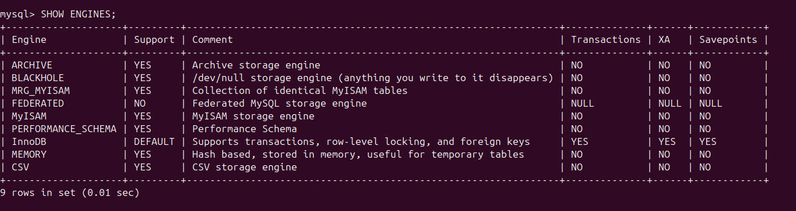

# Storage Engines bei MySQL
Eine Storage Engine ist für das Speichern, Abrufen und Verwalten von Daten auf der Festplatte oder im Speicher zuständig ist. In MySQL bestimmt die gewählte Storage Engine, wie Daten physisch gespeichert, indiziert und verwaltet werden. \
Hierbei kann aus mehreren Storage Engines gewählt werden, da jede Engine für unterschiedliche Anwendungsfälle optimiert ist. 


## InnoDB
InnoDB ist die Standardmässige Storage Engine für MySQL und wird für die meisten produktiven Anwendungen empfohlen

### Merkmale und Vorteile
- ACID Unterstützung: \
  Unterstützt **A**tomicity, **C**onsistency, **I**solation und **D**urability für zuverlässige Transaktionen
- Row-Level Locking: \
  Wenn ein Benutzer eine Tabelle am bearbeiten ist, wird jediglich die betroffene Zeile/n und nicht die ganze Tabelle --> Insert und Update relativ schnell
- Foreign Keys: \
  Unterstützt Foreign Keys um Verbindungen zwischen Tabllen herzustellen
- Crash-Recovery: \
  Nutzt den WAL-Mechanismus (Write-Ahead Logging) --> Geringes Risiko von Datenverlusten im Falle eines Absturzes


### Nachteile
- Höherer Speicherverbrauch: \
  Mehr Metadaten und Logs werden gespeichert
- Langsamer bei reinen Leseanfragen: \
  Durch die Transaktionskontrolle sind reine SELECT abfragen relativ langsam
- Keine Volltextsuche: \
  Unterstützt Volltextsuche erst ab MySQL Version 5.6

### Einsatzgebiete
- Anwendungen mit vielen Transaktionen (z. B. E-Commerce, Banking)
- Systeme bei denen häufig mehrere Benutzer gleichzeitig arbeiten
- Datenbanken mit Foreign Keys


## MyISAM
MyISAM war lange Zeit die Standard-Storage-Engine in MySQL, wurde aber von InnoDB abgelöst.

### Merkmale und Vorteile
- Sehr schnelle Lesezugriffe: \
  MyISAM ist optimiert um grosse SELECT abfragen schnell durchzuführen
- Full-Text Search: \
  Unterstützt Volltextsuche direkt in der Engine (z. B. für Suchmaschinen)
- Platzsparend: \
  Verbraucht weniger Speicher als InnoDB, da keine Transaktionslogs geschrieben werden (kann auch ein Nachteil sein)

### Nachteile
- Kein ACID-Support: \
  Keine Transaktionssicherheit (ACID) --> Datenverluste möglich.
- Table-Level Locking: \
  Sperrt die gesamte Tabelle wenn ein Benutzer diese am bearbeiten ist --> Schlechte Performance, da es so nicht möglich ist, dass mehrere Benutzer gleichzeitig an der gleichen Tabelle arbeiten können
- Kein Foreign-Key-Support: \
  Foreign-Keys werden nicht supportet --> Beziehungen zwischen Tabellen müssen manuell verwaltet werden

### Einsatzgebiete
- Datenbanken mit überwiegend SELECT abfragen
- Anwendungen, welche häufig Volltextsuche verwenden
- Datenbanken mit wenig Schreiboperationen
- Datenbanken, an welche nicht mehrere Benutzer gleichzeitig arbeiten


## InnoDB oder MyISAM?
| Merkmal        | InnoDB | MyISAM |
|---------------|--------|--------|
| **Transaktionen (ACID)** | ✅ Ja | ❌ Nein |
| **Referenzielle Integrität (Foreign Keys)** | ✅ Ja | ❌ Nein |
| **Lesegeschwindigkeit** | 🔹 Gut | ✅ Sehr schnell |
| **Schreibgeschwindigkeit** | ✅ Schnell | 🔹 Gut |
| **Speicherbedarf** | ❌ Höher | ✅ Niedriger |
| **Full-Text Search** | 🔹 Ab MySQL 5.6 | ✅ Ja |
| **Multi-User Funktionalität** | ✅ Sehr gut (Row-Level Locking) | ❌ Schlecht (Table-Level Locking) |


## Restliche Storage Engines

### Archive  
- Komprimierte Speicherung \
  Ideal für Log- und Archivdaten 
- Nur INSERT und SELECT möglich (keine Updates oder Deletes)

### Blackhole  
- Speichert keine Daten \
  Alle INSERTs werden verworfen 
- Ideal für Logging  

### Federated  
- Verbindet sich mit externen MySQL-Datenbanken \
  Kein Daten werden lokal gespeichert  
- Langsam, da Daten über das Netzwerk abgerufen werden 
- Ideal wenn externe MySQL-Datenbanken genutzt werden müssen

### Memory  
- Speichert Daten im RAM \
  Sehr schnell, aber Daten gehen nach Neustart verloren  
- Ideal für temporäre Tabellen und schnelle Abfragen

### CSV  
- Speichert Tabellen als CSV-Dateien \
  Ideal für Import/Export in andere Anwendungen
- Keine Indizes \
  Langsam bei grossen Datenmengen.  

### MRG_MYISAM (Merge)  
- Kombiniert mehrere MyISAM-Tabellen zu einer virtuellen Tabelle
- Praktisch für Partitionierung von grossen Datenmengen
- Ideal wenn mehrere MyISAM-Tabellen kombiniert werden sollen

### PERFORMANCE_SCHEMA
- Dient zur Überwachung der Performance von MySQL
- Speichert keine eigentlichen Nutzdaten, sondern nur Statistiken und Diagnoseinformationen.
- Hilft bei Performance-Analysen und Fehlersuche, indem es Abfragen, Sperren und Speicherverbrauch überwacht.


### Alle Storage Engines anzeigen
Auf MySQL können alle Storages Engines abgerufen werden mit folgendem Befehl.
```
SHOW ENGINES;
```
