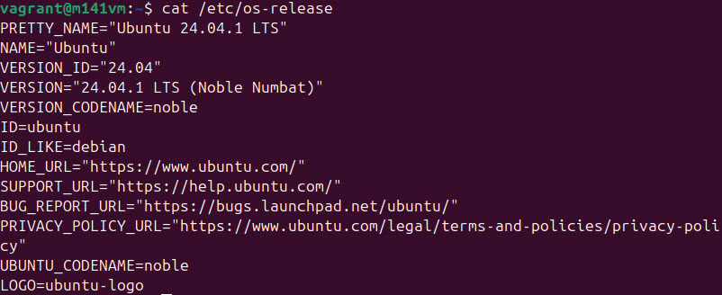
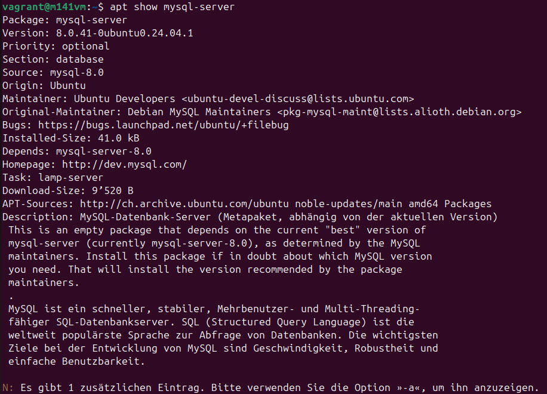
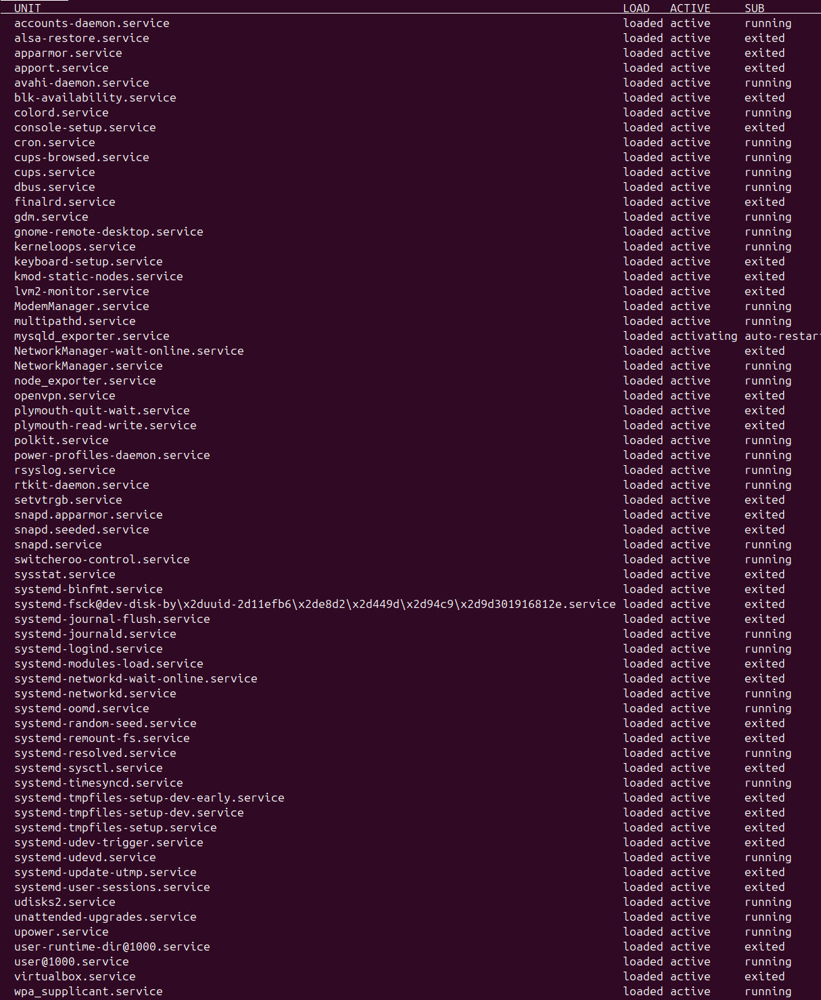

# Voraussetzungen bei der Installation von MySQL

## Betriebssystem
Ich nutze ein Ubuntu Betriebssystem mit der Version 24.04.1 LTS.
 \
Anstatt `cat /etc/os-release` könnte man auch `uname` verwenden.

## Quelle von der Software
MySQL wird mit dem Befehl `sudo apt install mysql-server`. \
Mit dem Befehl `apt show mysql-server` können Infos zum Paket abgerufen werden. \

## Version der Software
Wie man oben sieht, wird die Version 8.0.41 installiert, welche für die Ubuntu Version 24.04.1 geeignet ist.

## Andere Dienste
Mit dem Befehl `systemctl list-units --type=service` können alle installierten Dienste angezeigt werden. \

